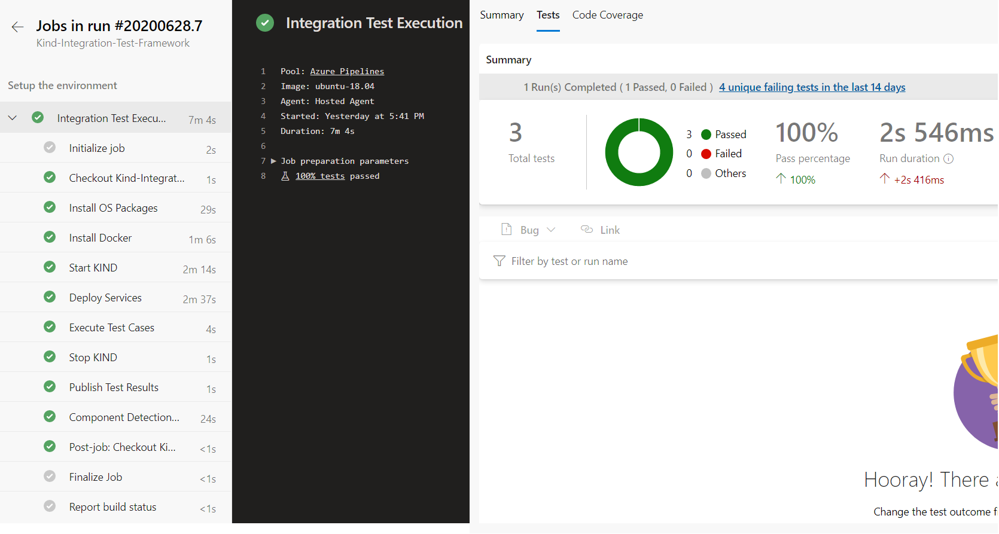

# Automated Test Environment for AKS Applications

Framework to create Automated Test Environment using [kind](https://kind.sigs.k8s.io/) for testing Azure Kubernetes Service (AKS) based applications in CI (Continuous Integration) Pipeline (Azure DevOps), where required dependencies/infrastructure will be provisioned for executing automated tests and deprovisioned after completion.

## Tools Used
1. [kind](https://kind.sigs.k8s.io/) - a tool for running local Kubernetes clusters using Docker container “nodes”.
2. [helm](https://helm.sh/) - the package manager for Kubernetes
3. [kubectl](https://kubernetes.io/docs/reference/kubectl/overview/) - command line tool to control Kubernetes clusters
4. [bash](https://www.gnu.org/software/bash/) - the GNU Project's shell

## Features

This is a very simple Framework, that creates Automated Test Environment to enable automated testing of applications hosted in [Azure Kubernetes Service (AKS)](https://docs.microsoft.com/en-us/azure/aks/) with the following features -

1. Create/Delete `kind` cluster in CI environment
2. Optional - [Azure Key Vault Provider for Secrets Store CSI Driver](https://github.com/Azure/secrets-store-csi-driver-provider-azure) [installation](https://github.com/Azure/secrets-store-csi-driver-provider-azure#install-the-secrets-store-csi-driver-and-the-azure-keyvault-provider) and [configuration](https://github.com/Azure/secrets-store-csi-driver-provider-azure/blob/master/docs/service-principal-mode.md)
3. Optional - [Azure Container Registry (ACR) Image Pull Secret](https://docs.microsoft.com/en-us/azure/container-registry/container-registry-auth-kubernetes#create-an-image-pull-secret)
4. Install `helm` charts of application (values needed for integration test environment can be overwritten easily)
5. Validate if the respective Kubernetes `pods` are up and running (multiple `pods` can be provided that are having selector - `app.kubernetes.io/name`)
6. [Port-Froward](https://kubernetes.io/docs/tasks/access-application-cluster/port-forward-access-application-cluster/#forward-a-local-port-to-a-port-on-the-pod) the respective Kubernetes `services` needed to perform integration testing (multiple `services` can be provided and the respective local ports will be starting from `8080` to `808[number of services]` maintaining the order as provided)

## Getting Started

This framework contains the following script and their options -

1. `start.sh`: Download all the dependencies and create `kind` cluster -
```sh
# Usage: bash -f ./start.sh
#        Supported Options -
#               --kind-cluster-name=<Kind Cluster Name> (default INTEGRATION_TEST_CLUSTER)
#               --kind-version (default v0.7.0)
#               --kubectl-version (default v1.18.0)
#               --helm-version (default v3.2.0)
```
2. `deploy.sh`: Deploy/Port-Forward application `helm chart` and enables optional features -
```sh
# Usage: bash -f ./deploy.sh
#        Supported Options - 
#              --csi-driver-enabled=<yes/no> (default no, if yes provide following two parameters)
#              --csi-driver-sp-client-id=<Azure Service Principle ID, having access to Azure Key Vault>
#              --csi-driver-sp-client-secret=<Azure Service Principle Secret, having access to Azure Key Vault>
#              --acr-imagepullsecret-enabled=<yes/no> (default no, if yes provide following three parameters)
#              --acr-imagepullsecret-sp-client-id=<Azure Service Principle ID, having access to Azure Container Registry>
#              --acr-imagepullsecret-sp-client-secret=<Azure Service Principle Secret, having access to Azure Container Registry>
#              --acr-full-name=<Azure Container Registry full name ex. example.azurecr.io>
#              --helm-chart-path=<Helm Chart Folder Path or URL to .tgz file for the applications >
#              --helm-chart-release-name=<Helm Release Name>
#              --helm-chart-set-parameters=<","(comma) seprated Helm Set parameters needed to be overwritten for integration test env>
#              --kubectl-check-services=<","(comma) seprated Pod names needed to be check if up and running>
#              --kubectl-check-services-selector-label=<ex. app.kubernetes.io/name or name etc.> (default app.kubernetes.io/name)
#              --kubectl-port-forward-services=<","(comma) seprated Service names needed to port-forward for testing>
```
3. `stop.sh`: Delete `kind` cluster -
```sh
# Usage: bash -f ./stop.sh
#        Supported Options -
#               --kind-cluster-name=<Kind Cluster Name> (default INTEGRATION_TEST_CLUSTER)
```

## Demo

For [demonstrating the framework](./sample) following setup has been used -

* Sample Application [azure-vote](https://github.com/Azure-Samples/helm-charts/tree/master/chart-source/azure-vote)
* [Azure DevOps Pipeline](https://azure.microsoft.com/en-us/services/devops/pipelines/) that demonstrate end-to-end flow of automated start/deploy/test/publish of integration test using this framework
* [Python Test Framework](https://docs.python.org/3/library/unittest.html) to perform some basic Integration Test

## Expected Outcome
It is expected to get Integration Test executed from CI Pipeline independently without disturbing existing development. The below images represents the outcome of the [sample for demonstrating the framework](./sample) -



## Resources

Some additional points need to be considered -

* While using Private Endpoint enabled `Azure Key Vault (AKV)` or `Azure Container Registry (ACR)` for applications, make sure the to use CI Pipeline Agent deployed in the same subnet where `AKV` or `ACR` endpoints are enabled


## References

* [Use KIND (Kubernetes in Docker) in CI/CD reliably - by @lawrencegripper](https://blog.gripdev.xyz/2020/01/15/use-kind-kubernetes-in-docker-in-ci-cd-reliably/)